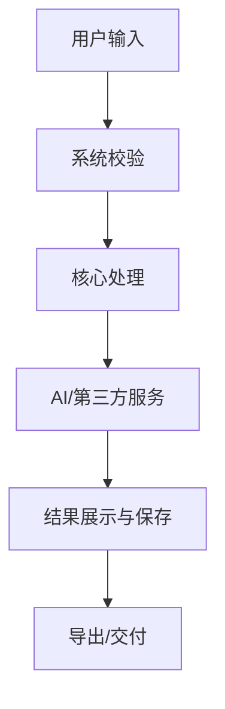

# Standard PRD Markdown Template

Use this template for Phase 4. Delete irrelevant sections only when the project is clearly too small.

```markdown
# [产品/功能名称] PRD

## 0. 文档说明

| 项目 | 内容 |
| --- | --- |
| 文档版本 | v0.1 |
| 创建日期 | [YYYY-MM-DD] |
| 作者 | [姓名/角色] |
| 当前状态 | 草稿 / 待评审 / 已确认 |

### 0.1 修订记录

| 版本 | 日期 | 修订人 | 修订内容 | 修订原因 | 审核人 |
| --- | --- | --- | --- | --- | --- |
| v0.1 | [YYYY-MM-DD] | [待确认] | 初版创建 | 初版 | [待确认] |

### 0.2 名词术语

| 词汇 | 别名 | 说明 |
| --- | --- | --- |
| [术语] | [别名] | [说明] |

## 1. 背景与目标

### 1.1 背景

[说明产品/功能为什么被提出, 背后的市场、用户、业务或运营问题是什么。]

### 1.2 目标用户

| 用户类型 | 用户特征 | 核心场景 | 主要痛点 |
| --- | --- | --- | --- |
| [用户] | [特征] | [场景] | [痛点] |

### 1.3 业务目标与成功指标

| 目标 | 衡量指标 | 当前基线 | 目标值 | 统计周期 |
| --- | --- | --- | --- | --- |
| [目标] | [指标] | [待确认] | [待确认] | [待确认] |

### 1.4 价值分析

- 用户价值: [说明]
- 产品价值: [说明]
- 公司/业务价值: [说明]

## 2. 范围定义

### 2.1 一句话产品定义

[在什么场景下, 为谁提供什么能力, 解决什么问题。]

### 2.2 MVP 范围

| 优先级 | 功能 | 解决的问题 | 说明 |
| --- | --- | --- | --- |
| Must | [功能] | [问题] | [说明] |

### 2.3 本版不做

| 不做项 | 原因 | 后续计划 |
| --- | --- | --- |
| [事项] | [原因] | [计划] |

### 2.4 约束与假设

| 类型 | 内容 | 状态 |
| --- | --- | --- |
| 假设 | [内容] | 待确认 |
| 约束 | [内容] | 已确认/待确认 |

## 3. 产品方案

### 3.1 功能结构

[用列表、表格或 Mermaid 表达模块层级。]

### 3.2 信息结构

[说明核心对象、字段、层级和关系。]

### 3.3 业务流程

[说明用户从触发到完成任务的主流程。必要时使用 Mermaid。]

### 3.4 页面流程

[说明页面进入、跳转、返回、退出、异常路径。]

## 4. 全局规则

### 4.1 权限与角色

| 角色/状态 | 可见内容 | 可操作内容 | 限制 |
| --- | --- | --- | --- |
| [角色] | [内容] | [操作] | [限制] |

### 4.2 全局状态

| 状态 | 展示规则 | 用户操作 | 系统处理 |
| --- | --- | --- | --- |
| 空状态 | [规则] | [操作] | [处理] |
| 加载中 | [规则] | [操作] | [处理] |
| 离线/失败 | [规则] | [操作] | [处理] |

### 4.3 文案与交互规范

[说明命名、语气、提示、Toast、弹窗、二次确认、撤销、错误提示等规则。]

## 5. 需求列表

| 编号 | 模块 | 需求 | 类型 | 优先级 | 迭代 | 说明 |
| --- | --- | --- | --- | --- | --- | --- |
| R1 | [模块] | [需求] | 功能/非功能/数据 | P0 | MVP | [说明] |

## 6. 需求详情

### R1. [功能名称]

#### 6.1 用户故事

作为 [用户], 我希望 [能力], 以便 [价值]。

#### 6.2 业务规则

1. [规则]
2. [规则]

#### 6.3 页面与交互

| 场景 | 页面/控件 | 规则 | 异常处理 |
| --- | --- | --- | --- |
| [场景] | [页面/控件] | [规则] | [异常] |

#### 6.4 字段与数据

| 字段 | 类型 | 是否必填 | 默认值 | 校验规则 | 说明 |
| --- | --- | --- | --- | --- | --- |
| [字段] | [类型] | 是/否 | [默认] | [规则] | [说明] |

#### 6.5 验收标准

- Given [前置条件], When [操作], Then [预期结果]。
- Given [异常条件], When [操作], Then [系统反馈]。

#### 6.6 边界与异常

| 场景 | 系统表现 | 用户提示 | 是否阻断 |
| --- | --- | --- | --- |
| [异常] | [表现] | [提示] | 是/否 |

## 7. 非功能需求

| 类型 | 要求 | 指标/标准 | 说明 |
| --- | --- | --- | --- |
| 性能 | [要求] | [指标] | [说明] |
| 稳定性 | [要求] | [指标] | [说明] |
| 安全/合规 | [要求] | [指标] | [说明] |
| 兼容性 | [要求] | [指标] | [说明] |

## 8. 埋点与数据

| 事件名 | 触发时机 | 参数 | 参数说明 | 用途 |
| --- | --- | --- | --- | --- |
| [event_name] | [时机] | [参数] | [说明] | [用途] |

## 9. 项目计划

| 阶段 | 开始时间 | 结束时间 | 交付物 | 负责人 | 状态 | 风险 |
| --- | --- | --- | --- | --- | --- | --- |
| 需求评审 | [日期] | [日期] | PRD | [人] | 待开始 | [风险] |

## 10. 工作流设计

> 仅在 Phase 4 完整版 PRD 中生成本节。诊断、概念对齐和 MVP 信息补齐阶段只记录工作流输入与待确认项，不强制展开完整设计。

### 10.1 开发工作流

[说明开发协作如何运转。不要和产品运行链路混写。]

| 角色/工具 | 主要用途 | 输入 | 输出 | 注意事项 |
| --- | --- | --- | --- | --- |
| Codex | [实现、调试、测试、生成页面等] | [PRD/任务] | [代码/页面/测试结果] | [限制] |
| Claude | [架构评审、PRD 复核、提示词优化、代码 review 等] | [PRD/代码/提示词] | [评审意见/优化建议] | [限制] |

### 10.2 AI 开发成本、产出预估与 ROI

> 适用于用 AI 参与开发的项目。项目启动前先估算成本和产出，执行过程中记录实际 token、金额和交付物，结束后对比预估与实际，并为后期计算 ROI 保留收益口径。不要编造数据；缺失时标记为 `待估算`、`待统计` 或 `待确认`。

| 统计项 | 口径 | 状态 |
| --- | --- | --- |
| 统计范围 | 需求、设计、编码、调试、评审、测试、上线准备等开发阶段 AI 使用 | 待确认 |
| 平台范围 | Codex、Claude、Tuzi/OpenAI/Gemini 等实际使用的平台 | 待确认 |
| 估算层级 | 粗估 / 计划估算 / 执行估算 / 实际回填 | 待确认 |
| Token 指标 | 输入 tokens、输出 tokens、缓存/思考/其他平台特有 tokens、总 tokens | 待确认 |
| 金额指标 | 单平台金额、总金额、币种、汇率口径、是否含税/订阅费 | 待确认 |
| 数据来源 | 平台账单、Dashboard、API 导出、日志或人工记录 | 待确认 |
| 价格口径 | 模型单价、价格来源链接、价格查询日期、估算公式 | 待确认 |
| ROI 口径 | ROI = (AI 产生收益 - AI 开发成本) / AI 开发成本 * 100% | 待确认 |
| 收益范围 | 节省人时、减少外包/人力成本、提前上线价值、收入增长、效率提升、返工减少 | 待确认 |

预估成本表：

| 阶段 | 平台/工具 | 任务 | 预计轮次/调用量 | 预计输入 tokens | 预计输出 tokens | 预计其他 tokens | 单价/计费口径 | 预估金额 | 币种 | 估算依据 | 置信度 |
| --- | --- | --- | --- | --- | --- | --- | --- | --- | --- | --- | --- |
| [阶段] | Codex | [任务] | 待估算 | 待估算 | 待估算 | 待估算 | 待确认 | 待估算 | [币种] | [依据] | 低/中/高 |
| [阶段] | Claude | [任务] | 待估算 | 待估算 | 待估算 | 待估算 | 待确认 | 待估算 | [币种] | [依据] | 低/中/高 |
| 合计 | 全平台 | - | 待估算 | 待估算 | 待估算 | 待估算 | - | 待估算 | [币种] | - | 待确认 |

预估产出表：

| 产出类型 | 预估产出 | 数量/范围 | 验收标准 | 价值口径 | 预估价值 | 币种 | 估算依据 | 置信度 |
| --- | --- | --- | --- | --- | --- | --- | --- | --- |
| 文档 | [PRD/技术方案/测试清单等] | 待估算 | [标准] | 节省人时/减少返工 | 待估算 | [币种] | [依据] | 低/中/高 |
| 功能 | [核心功能/页面/接口等] | 待估算 | [标准] | 提前上线/效率提升 | 待估算 | [币种] | [依据] | 低/中/高 |
| 资产 | [组件/脚本/模板/提示词等] | 待估算 | [标准] | 可复用价值 | 待估算 | [币种] | [依据] | 低/中/高 |

| 日期/阶段 | 平台 | 工具/模型 | 输入 tokens | 输出 tokens | 其他 tokens | 总 tokens | 金额 | 币种 | 数据来源 | 实际/估算 | 备注 |
| --- | --- | --- | --- | --- | --- | --- | --- | --- | --- | --- | --- |
| [日期/阶段] | Codex | [模型/计划] | 待统计 | 待统计 | 待统计 | 待统计 | 待统计 | [币种] | [来源] | 待确认 | [说明] |
| [日期/阶段] | Claude | [模型/计划] | 待统计 | 待统计 | 待统计 | 待统计 | 待统计 | [币种] | [来源] | 待确认 | [说明] |
| 合计 | 全平台 | - | 待统计 | 待统计 | 待统计 | 待统计 | 待统计 | [币种] | - | 待确认 | [说明] |

预估 vs 实际偏差表：

| 项目 | 预估值 | 实际值 | 偏差 | 偏差原因 | 后续修正 |
| --- | --- | --- | --- | --- | --- |
| AI 开发成本 | 待估算 | 待统计 | 待统计 | 待确认 | 待确认 |
| 核心功能产出 | 待估算 | 待统计 | 待统计 | 待确认 | 待确认 |
| 文档/测试/资产产出 | 待估算 | 待统计 | 待统计 | 待确认 | 待确认 |

ROI 收益记录表：

| 收益项 | 计算方式 | 基线 | AI 后结果 | 收益金额 | 币种 | 统计周期 | 数据来源 | 实际/估算 | 置信度 | 备注 |
| --- | --- | --- | --- | --- | --- | --- | --- | --- | --- | --- |
| 节省人时 | 节省小时数 * 人力时薪 | 待确认 | 待确认 | 待统计 | [币种] | [周期] | [来源] | 待确认 | 待确认 | [说明] |
| 提前上线价值 | 提前天数 * 日均价值 | 待确认 | 待确认 | 待统计 | [币种] | [周期] | [来源] | 待确认 | 待确认 | [说明] |
| 合计收益 | 各收益项求和 | - | - | 待统计 | [币种] | [周期] | - | 待确认 | 待确认 | [说明] |

ROI 汇总：

| 指标 | 公式/口径 | 数值 | 状态 |
| --- | --- | --- | --- |
| AI 开发总成本 | 各平台开发阶段 AI 成本求和 | 待统计 | 待确认 |
| AI 产生总收益 | 各收益项求和 | 待统计 | 待确认 |
| AI 开发 ROI | (AI 产生总收益 - AI 开发总成本) / AI 开发总成本 * 100% | 待统计 | 待确认 |
| 投入回收期 | AI 开发总成本 / 周期平均收益 | 待统计 | 待确认 |

### 10.3 产品运行工作流

[说明真实用户使用产品时，系统从输入到输出的运行链路。必要时使用 Mermaid。]



### 10.4 模型与工具路由

| 任务 | 默认工具/模型 | 兜底方案 | 选择理由 | 风险/待确认 |
| --- | --- | --- | --- | --- |
| [任务] | [工具/模型] | [兜底] | [理由] | [待确认] |

### 10.5 配置与安全

| 项目 | 建议 | 状态 |
| --- | --- | --- |
| API Key | 只放后端环境变量，不写入前端 | 待确认 |
| Base URL | [如适用，填写第三方网关地址] | 待确认 |
| 隐私 | [说明哪些数据会传给第三方，哪些不能上传] | 待确认 |

### 10.6 更新规则

当用户更新开发工具、模型供应商、模型路由、API 地址、角色分工、运行链路、里程碑、环境变量、隐私、安全策略、token 用量、开发成本、产出估算、收益假设或 ROI 口径时，同步更新本节，并在修订记录中说明原因。

## 11. 风险与待确认

| 编号 | 风险/问题 | 影响 | 处理建议 | 状态 |
| --- | --- | --- | --- | --- |
| Q1 | [问题] | [影响] | [建议] | 待确认 |

## 12. 附录

- 竞品资料: [链接/说明]
- 原型: [链接/说明]
- 参考资料: [链接/说明]
```
